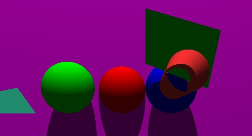
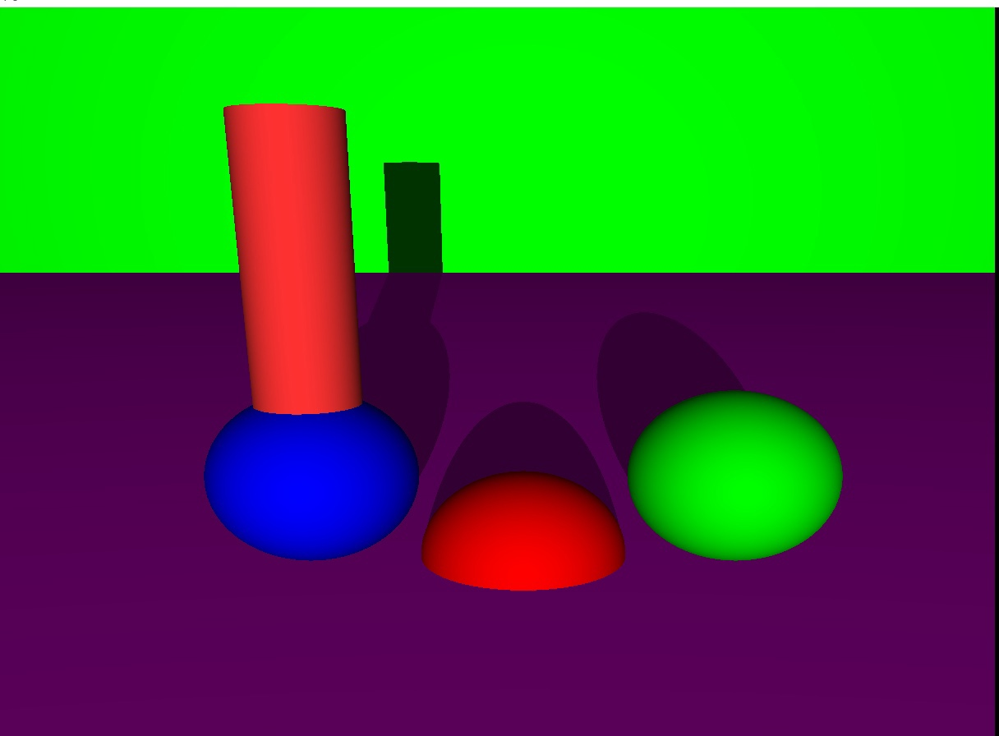
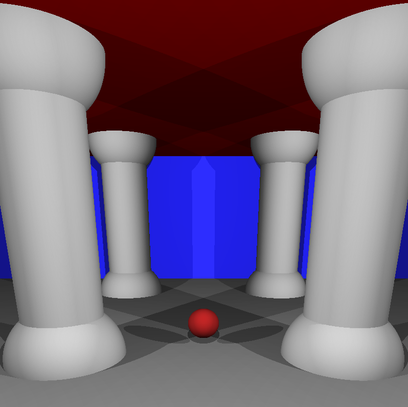

# ft_miniRT
This project is an introduction to the beautiful world of Raytracing. Once completed you will be able to render simple Computer-Generated-Images and you will never be afraid of implementing mathematical formulas again

### examples

